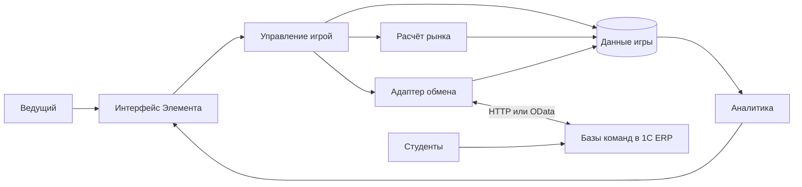
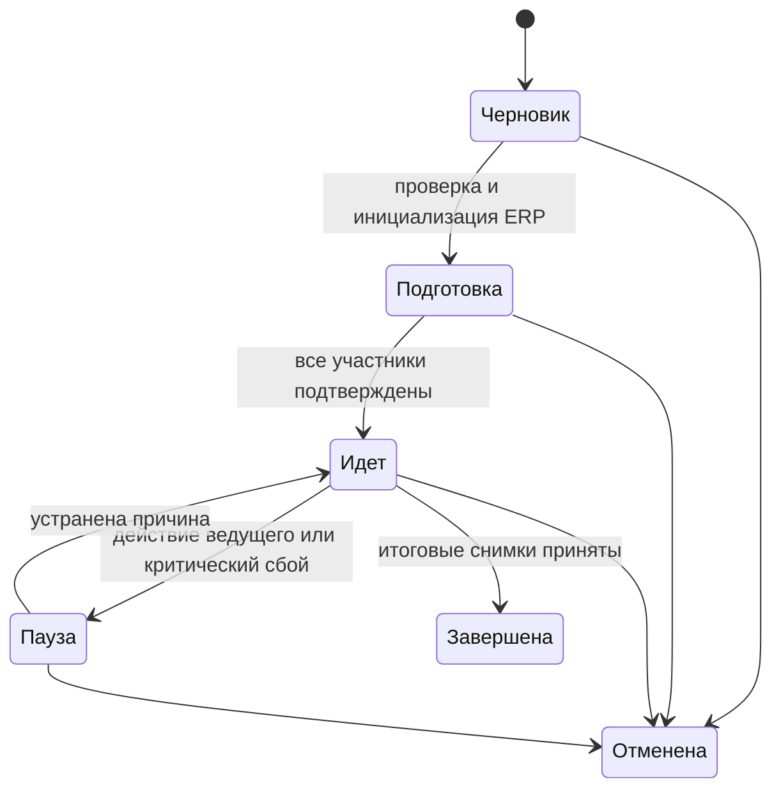

# Архитектура приложения

## Назначение и границы

Приложение Элемента — сервер внешнего рынка и рабочее место ведущего. Оно хранит сценарии, состав участников, состояние игры, зафиксированные предложения команд, расчёты рынка и подтверждённые результаты ERP.

ERP ведёт оперативный и финансовый учёт. Учебные действия выполняются в её интерфейсе. Автоматический обмен не означает автоматическое выполнение всех закупок, производства и отгрузок за студентов.

В первую версию входят оба алгоритма рынка, управление несколькими играми, автоматический обмен, контроль готовности команд, журнал действий и рейтинг. Одиночная игра — сессия с одним участником; многокомандная — с несколькими. Полноценная турнирная сетка, учебный онлайн-курс и отдельный кабинет студента — последующие этапы.

## Распределение ответственности

| Область | Элемент | ERP |
|---|---|---|
| Сценарий, раунды, сроки | Создание и управление | Применение разрешённых действий по фазе |
| Продукты и соответствия | Игровые коды и параметры спроса | Номенклатура и характеристики конкретной базы |
| Цены предложения | Фиксация снимка перед расчётом | Ввод цен командой |
| Закупки, производство, запасы | Чтение состояния и контроль готовности | Документы, движения, обеспеченность |
| Рыночный спрос | Расчёт заказов | Приём рассчитанных заказов |
| Продажа и оплата | Сопоставление заказа и исполнения | Отгрузка, реализация, поступление денег |
| Результаты | Рейтинг и сравнение | Фактические деньги, прибыль, задолженность |

## Логическая схема

## Подсистемы Элемента

| Подсистема | Содержание | Используемые подсистемы |
|---|---|---|
| `Данные` | Перечисления, справочники, регистры, общие структуры и локальные проверки записи | Нет |
| `Рынок` | Серверный модуль расчёта и диагностические структуры | `Данные` |
| `Обмен` | HTTP-сервис, адаптеры ERP, очередь, нормализация данных | `Данные` |
| `Аналитика` | Запросы результатов и формы отчётов | `Данные` |
| `Управление` | Пульт ведущего, мастер игры, переходы фаз, главная страница | Все перечисленные выше |

Граф зависимостей направлен в одну сторону. `Данные` не вызывает `Управление`: это исключает цикл между объектами и оркестратором. Объектные формы справочников находятся рядом с метаданными и редактируют только разрешённые настройки. Команды запуска и смены фаз размещаются в независимом пульте подсистемы `Управление`.

Типы, используемые другой подсистемой, получают `ОбластьВидимости: ВПроекте`. В потребителе задаются `Использование` подсистемы и `Импорт` пространства имён. Внутренние модули сохраняют минимальную необходимую видимость.

## Цикл игры

Проектное предложение основано на подробном сценарии `Сценарий игры.xlsx`.

| Раунд и фаза | Действия | Условие завершения |
|---|---|---|
| Подготовка игры | Сценарий, подключения, соответствия, равные стартовые ресурсы | Все базы проверены, инициализация подтверждена |
| Раунд 0: стартовая продажа | Цены стартовых велосипедов, расчёт рынка, заказы, отгрузка | Заказы и деньги подтверждены ERP |
| Раунд 1…N: планирование | Цены и планы продаж, производства, закупок | Готовность участников либо решение ведущего о пропуске |
| Закупки | Заказы поставщику, поступление и оплата | Снимки фактического состояния ERP |
| Производство | Заказы и этапы производства, перемещения и выпуск | Готовность и наличие подтверждённого выпуска |
| Продажи | Фиксация цен и остатков, расчёт, создание заказов, отгрузка | Сверка рассчитанных и фактических продаж |
| Анализ | Закрытие месяца, сбор денег, прибыли и задолженности | Приняты финальные снимки всех участников |

В исходных документах продажи иногда происходят по ценам, утверждённым до закупок, а иногда разрешена корректировка перед продажей. Это настройка сценария `МоментФиксацииЦен`: после планирования или перед продажами. После выбранного момента цены снимка неизменяемы. По умолчанию проект предлагает второй вариант, соответствующий подробному сценарию.

Переход фаз выполняет ведущий. Срок — основание для предупреждения и закрытия приёма изменений, но не для молчаливого выполнения следующей фазы при отсутствии ERP. Автоматическое переключение можно добавить после проверки таймеров и блокировок в целевой сборке платформы.

## Состояния

У фазы отдельное техническое состояние: `Открыта`, `Фиксация`, `Расчет`, `ОжиданиеERP`, `Закрыта`, `Ошибка`. Фаза продаж внутри себя проходит фиксацию предложений, расчёт заказов и ожидание отгрузок; это не три дополнительных учебных раунда.

Каждый переход увеличивает `ВерсияСостояния` игры и создаёт новый `ТокенФазы`. Сервер проверяет ожидаемую версию в команде ведущего и соответствие токена в сообщении ERP. Одновременный запрос второго ведущего с устаревшей версией отклоняется.

Пауза прекращает новые учебные действия и сохраняет остаток времени. Подтверждения уже выполненных команд принимаются и сверяются, чтобы после возобновления не повторить операции. Время хранится как `Момент`; игровой месяц хранится отдельно и не подменяет реальное время.

## Фиксация и расчёт

1. Ведущий начинает закрытие фазы. Сервер сохраняет операцию фиксации и токен.
2. ERP запрещает изменения нужных для снимка данных в игровой области и подтверждает ограничение.
3. Для каждого участника получен согласованный снимок под этим токеном.
4. Сервер проверяет полноту товаров, единицы, цены, количества и финансовые показатели.
5. Создаётся единственный окончательный расчёт рынка для раунда. Предварительный просмотр не отправляет команды ERP.
6. Расчёт и команды создания заказов сохраняются атомарно в локальной БД Элемента.
7. Обмен исполняется после фиксации транзакции; сетевые вызовы не удерживают блокировки игры.
8. Фактические отгрузки и платежи принимаются отдельно. Только после их сверки закрывается раунд.

Атомарность между Элементом и несколькими ERP не предполагается. Используется сохранённая очередь операций с повторной доставкой. Наличие транзакции в Элементе не отменяет необходимости дедупликации в ERP.

## Рейтинг

Основной показатель — деньги участника на конец игры после подтверждения финальных снимков ERP. Запасы не входят в оценку. При равенстве денежных остатков команды делят место: скрытых дополнительных критериев нет.

Прибыль, выручка, остатки, доля рынка и задолженность показываются как аналитика. Неоплаченные закупки не должны искусственно улучшать рейтинг: перед финализацией требуется исполнить предусмотренные сценарием оплаты и проверить долг поставщику. Наличие кредита или перенос долга допускается только отдельным правилом сценария; первая версия этого не предусматривает.

## Права

| Прикладная роль | Возможности |
|---|---|
| Администратор | Подключения, пользователи, общие настройки, обслуживание |
| Ведущий | Назначенные игры, создание сценариев, управление фазами, результаты |
| Наблюдатель | Только опубликованные результаты назначенных игр |
| Сервис ERP | Состояние и команды только назначенного подключения и участника |

Роли — прикладная модель, не выдуманный `ВидЭлемента: Роль`. Для реализации используются подтверждённые механизмы `ПравоНаДействие`, `КлючДоступа`, `КонтрольДоступа` и серверные проверки привязки пользователя к игре.

Каталоги приватных объектов защищаются RLS по игре и назначению пользователя. Регистры не публикуются для прямой записи обычными пользователями; доступ через проверяющие серверные методы. Контроль на кнопке дополняется проверкой каждого серверного действия и маршрута API.

## Ограничения проекта

- Режим совместимости `10.0` и точная облачная сборка — разные параметры. Сборку нужно выбрать на этапе стенда.
- `ИнтегрируемоеПриложение` в прочитанном reference предназначено для внешнего приложения Element; оно не принимается за готовый коннектор к ERP 8.3.
- Не создаётся второй складской или денежный учёт через регистры накопления в Элементе.
- Конкретные вызовы блокировок, транзакций, фоновой обработки и HTTP-клиента подтверждаются по документации точной сборки перед написанием XBSL.
