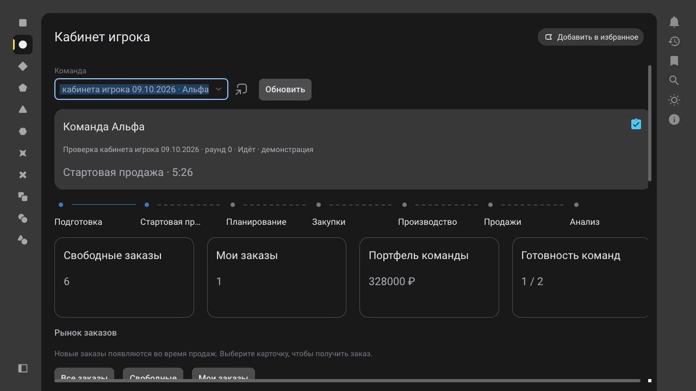
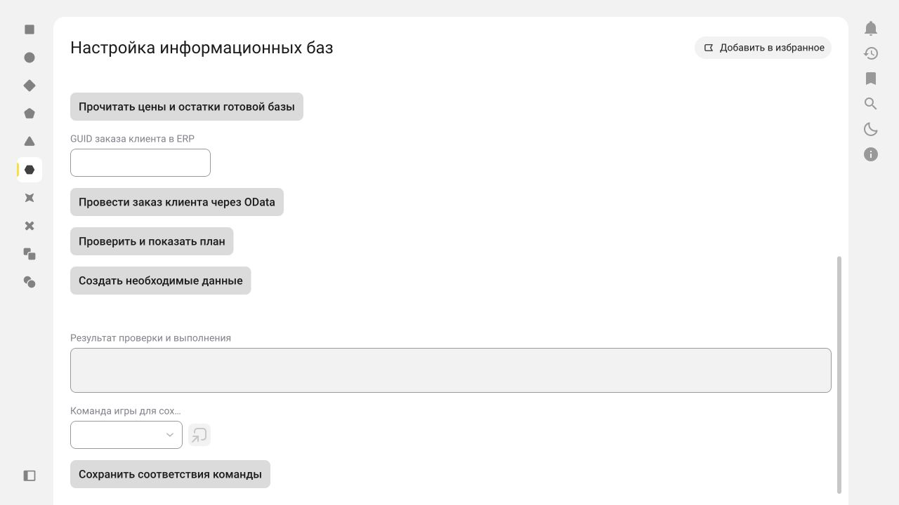
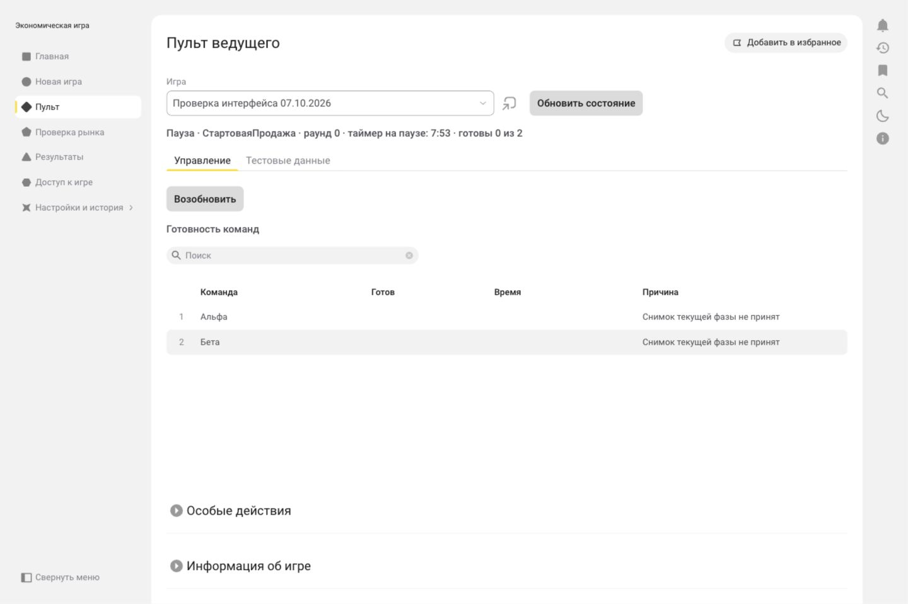
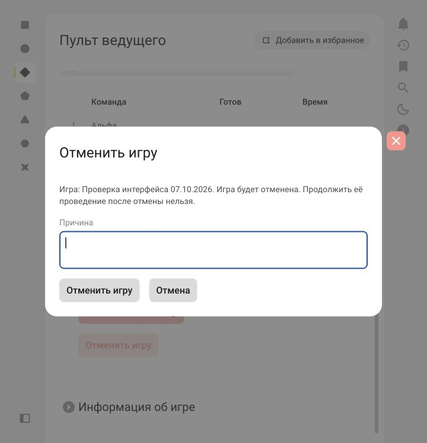
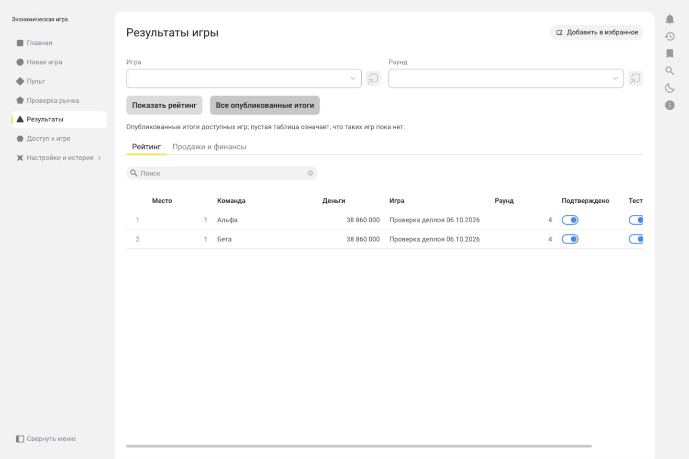
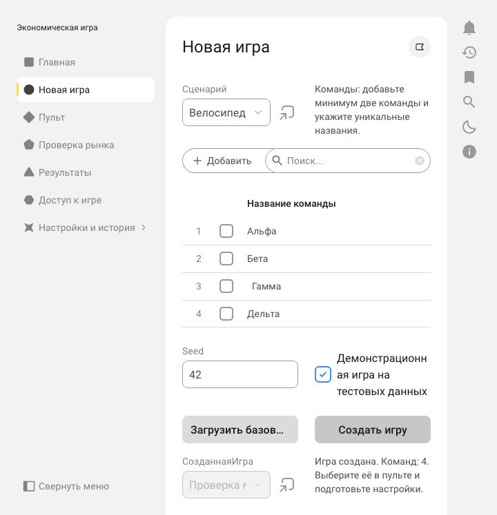

# Деплой тестового приложения

## Кабинет игрока и случайный общий рынок — 1.0-40

9 октября 2026 года, 23:38:30 МСК, успешно применена сборка `1.0-40` в [game-dev](https://app-312909758.1cmycloud.com/applications/game-dev). Задача `01a12263-5401-77cf-a770-b29f1c68d11e` — `Completed`; приложение — `Running`, без ошибки и текущей задачи. Активная сборка `01a12263-0f3c-7611-96b3-348b24f9a86e` подтверждена по `source.project-version-id`, технология — `10.0.3-20`.

Архив собран из чистой рабочей копии `dev`, коммит `a355b73cf745ce77c7c9adc6a9b907890c268868`; этот хеш проверен в `Assembly.yaml`. SHA-256: `d1034821726cb07c1dd118712fb9aaa060e9b9b73d945293801d5719d43c3e74`. Перед обновлениями сохранены дампы `01a1225a-f970-7d4c-bd1f-79e2f25738d0` (8 800 462 байта) и `01a12262-6fac-76e0-87a4-130320c8429e` (9,222,448 байт), оба `Ready`, без пользователей, бинарных данных и данных взаимодействия.

Первая сборка `1.0-38` выявила нетипизированные значения надписей, недопустимое содержимое контейнера списка и превышение длины ключа регистра заявлений. Ошибки исправлены; `1.0-39` прошла компиляцию. Проверка в браузере дополнительно выявила отсутствие токена подготовки в демо. В итоговой `1.0-40` токен создаётся в обоих режимах, панель этапов горизонтальная, группы показателей растягиваются по ширине.

В отдельной демонстрационной игре «Проверка кабинета игрока 09.10.2026» проверены случайное появление восьми заказов четырёх моделей, получение заказа №1 командой «Альфа», видимость получателя команде «Бета», завершение этапа и сохранение готовности после паузы. Игра оставлена на паузе. На итоговой сборке в новой игре «Проверка подготовки игрока 09.10.2026» проверено завершение подготовки «Альфы»; игра оставлена в подготовке. Использовалась одна учётная запись администратора с переключением команд, а не две независимые учётные записи. Реальная ERP в этом проходе не изменялась; конкурентное получение в БД остаётся непроверенным.

Пройдены 86 локальных тестов, включая исходный генератор и OData на нативном Element Script 10.0 с тестовым транспортом. Проверены 120 YAML, согласованность 56 XBSL и `git diff --check`. Журнал браузера за проверку не содержит предупреждений и ошибок.

[Описание кабинета](player-cabinet.md), [машинный протокол](verification/player-cabinet-deploy-2026-10-09.json).

## Чтение готовой ERP и проведение заказов через OData — 1.0-37

9 октября 2026 года, 11:53:01 МСК, успешно применена сборка `1.0-37` (технология `10.0.3-20`) в [приложении «Игра»](https://app-312909758.1cmycloud.com/applications/game-dev). Задача `01a11fdd-6f49-7588-97e7-f3cf502ed31d` завершена со статусом `Completed`; приложение — `Running`, без ошибки и текущей задачи. Активная сборка `01a11fdd-2bf2-7ea0-996a-7bbdde6c1efb` проверена по `source.project-version-id`.

Архив собран из чистой рабочей копии `dev`, коммит `b6242a817e6be2a2ca559b9a2912dbbf4e3d4ab2`, отправленный в `origin/dev`. Этот же хеш проверен в `Assembly.yaml`. SHA-256 архива: `b70c319d45d4a577ce925fa4c1ed5392698fc1be44e61b9e85547ab85c800813`. Перед обновлением сохранён дамп `01a11fdb-a4fe-7ded-884e-8178359f0a10`: `Ready`, 8 784 527 байт; пользователи, бинарные данные и данные взаимодействия в него не включены.

Опубликованы чтение фактических продажных цен и свободных остатков готовой базы, поддержка фактического начального пакета ERP и проведение сохранённого заказа клиента по GUID через стандартный OData action `Post()`. Полная облачная компиляция прошла. Локально проверены 83 теста, включая исходные методы в нативном Element Script 10.0, восстановление после потери ответа и ограничения цены разных раундов. Проверены 108 YAML, 51 XBSL-файл и `git diff --check`; валидатор метаданных — 0 ошибок, 35 предупреждений о UI/контейнерах вне покрытия.

В опубликованной форме видны новые команды и поле GUID. Адрес подключения «Учебная ERP — ИГРА 2» проверен: `https://edu.1cfresh.com/a/edu_erp_spbpu/1538260/odata/standard.odata/`. Подключение на момент проверки было неактивным; его настройки не изменялись, вызовы ERP из опубликованной формы не выполнялись. До деплоя реальный цикл отмены/проведения того же заказа через исходный метод Элемента и OData подтверждён отдельно, без расширения ERP.

[Инструкция](odata-setup.md), [проверка заказа](market-erp.md), [машинный протокол деплоя](verification/odata-posting-deploy-2026-10-09.json).

## Настройка информационных баз через OData — 1.0-35

9 октября 2026 года, 10:35:26 МСК, успешно применена сборка `1.0-35` (Элемент `10.0.3-20`). Задача `01a11f96-6335-7660-8004-6aed4e3aced3` завершена со статусом `Completed`; приложение — `Running`, без ошибки и текущей задачи. Активная сборка `01a11f96-3eb6-7573-b883-f5e0e6024223` проверена по `source.project-version-id`. Перед обновлением сохранён дамп `01a11f91-cb83-75a6-b01a-dc6cb54f10cf`: `Ready`, 8 710 897 байт.

В опубликованной форме пройдены проверка подключения, вывод плана, повторное применение 63 шагов и очистка пароля. На учебной ERP подтверждены четыре стартовых остатка, 15 начальных цен, 11 цен поставщика и стоимость запасов 1 301 800 руб. [Границы настройки и инструкция](odata-setup.md), [протокол проверки](verification/odata-setup-2026-10-09.json).

## Доработки админской панели — 1.0-31

8 октября 2026 года, 18:01:27 МСК, успешно применена сборка `1.0-31`. [Приложение «Игра»](https://app-312909758.1cmycloud.com/applications/game-dev), [состав доработок и инструкция](admin-panel.md).

| Проверка | Подтверждённое значение |
|---|---|
| Технология приложения | `10.0.3-20` |
| Задача обновления | `01a11c08-6427-7856-86a0-b11a29e49b78` — `Completed` |
| Работающее приложение | `01a11178-7183-71ae-bfac-e21e4036537f` — `Running` |
| Сборка в приложении | `01a11c08-1e46-7864-8126-8e9fee573e98` — `1.0-31` |
| Ошибка / текущая задача | Отсутствуют |
| SHA-256 архива | `38d9e15af1b69cd426fb2a8c429ad32e58fe057529cbd0542cad875e81b4fa37` |

Перед первой публикацией сохранён дамп `01a11bfa-affc-7797-819c-79d9e7de24ee`: `Ready`, 8 469 443 байта, создан в 17:46:16 МСК. Перед окончательным обновлением сохранён дамп `01a11c07-50ad-7fcc-86f9-97b58267d353`: `Ready`, 8 699 765 байт, создан в 18:00:03 МСК. Дампы не включают пользователей, бинарные данные и данные взаимодействия.

В `1.0-29` нативный компилятор выявил составной тип результата `МАКСИМУМ(ВремяПриема)` и требование `СобытиеПриИзменении<Булево?>` у флажка. Запросы времени заменены выбором первой строки с сортировкой, обработчик исправлен. `1.0-30` полностью скомпилирована и применена. `1.0-31` дополнительно ограничивает выбор раундов выбранной игрой, а сверку — неподтверждёнными периодами и их командами; окончательная нативная компиляция и применение подтверждены отдельно.

Локальные проверки: 105 YAML, 99 объектов, 414 UUID, согласованность 48 XBSL-файлов, 65 тестов без пропусков. Нативный тест протокола выполнил 65 случаев схем, канонического JSON/SHA-256, денежных правил, календаря и очереди. Валидатор метаданных: 0 ошибок, 34 предупреждения о UI/контейнерах вне покрытия. `git diff --check` пройден.

В браузере открыты диагностика, сверка, таблица соответствий и пять вкладок результатов. На существующей демонстрационной игре прочитаны две команды, восемь строк продаж по четырём моделям, восемь остатков и десять итогов за раунды 0–4. На окончательной `1.0-31` повторно проверены отсутствие раундов других игр в списке и чтение финального рейтинга. Игровые записи, соответствия и итоги через интерфейс не изменялись.

Административная сверка выполняется ручным импортом свежего финального снимка ERP; обычный HTTP-приём сохраняет проверки текущего токена и исходной версии фиксации. Запись такого исправления с настоящими данными, сохранение соответствий ERP, отдельные роли, конкурентность и полный игровой цикл с расширением ещё требуют интеграционного прохода.

Сборка загружена из рабочей копии `dev` с исходным коммитом `10f7f2c3ae5add31c8bc78b7772f3b282ad41fd9` и локальными изменениями. Точный применённый артефакт определяется SHA-256 выше. Документация добавлена после обновления.

## HTTP-контракт ERP 1.0 — 1.0-27

8 октября 2026 года, 00:12:34 МСК, успешно применена сборка `1.0-27` со всеми изменениями локальной рабочей копии `dev`, включая HTTP-сервисы ERP и доработки интерфейса. [Открыть приложение «Игра»](https://app-312909758.1cmycloud.com/applications/game-dev).

| Проверка | Подтверждённое значение |
|---|---|
| Технология приложения | `10.0.3-20` |
| Задача обновления | `01a11835-b7e5-7f9a-84cc-fba537118326` — `Completed` |
| Работающее приложение | `01a11178-7183-71ae-bfac-e21e4036537f` — `Running` |
| Сборка в приложении | `01a11835-7800-764d-8b55-e8f967c2edea` — `1.0-27` |
| Ошибка / текущая задача | Отсутствуют |
| SHA-256 архива | `75e8b295d9fb9fec354baef3e27846aea64da40b25385df5bc9a0212b7bbcdf4` |

Перед обновлением сохранён дамп `01a11834-1d20-7966-a046-42e65e19cd84`: `Ready`, 8 060 311 байт, создан в 00:10:30 МСК. Дамп не включает пользователей, бинарные вложения и данные взаимодействия.

Сборка `1.0-26` выявила ошибки свойств форм и окружений общих модулей. Исправлены строковые литералы надписей, многострочный ввод перенесён в `НастройкиВводаСтроки`. Модули `НастройкиERP` и `ОбменERP` переведены в окружение `КлиентИСервер`; их методы явно выполняются на сервере, методы настройки доступны формам. Сборка `1.0-27` прошла полную нативную компиляцию и применена. Проверены точный идентификатор новой сборки, завершение новой задачи обновления и состояние приложения после публикации.

Локальные проверки после исправлений: 93 YAML, 87 объектов, 402 UUID; согласованность 44 XBSL-файлов; 51 тест пройден. Нативный Element Script 10.0 проверил 65 случаев JSON-схем, канонический JSON/SHA-256, суммы/НДС, профиль/календарь и очередь. Валидатор метаданных: 0 ошибок, 32 предупреждения о типах UI и контейнеров вне покрытия. `git diff --check` пройден.

После публикации выполнены запросы без токена ко всем семи маршрутам: `context`, `commands`, `snapshots`, `readiness`, `receipt`, `sales-events`, `execution-events`. Все вернули HTTP `403`. Авторизованный обмен с ERP, конкурентные операции и полный игровой цикл через новый протокол в этом проходе не проверялись; игровые данные через интерфейс не изменялись.

Архив загружен из локальной рабочей копии `dev` до финального коммита. Точный применённый артефакт определяется SHA-256 выше; документация публикации добавлена после обновления приложения.

## Исправление представлений — 1.0-25

7 октября 2026 года, 12:21:57 МСК, успешно применена сборка `1.0-25`. [Открыть приложение «Игра»](https://app-312909758.1cmycloud.com/applications/game-dev).

| Проверка | Подтверждённое значение |
|---|---|
| Технология приложения | `10.0.3-20` |
| Задача обновления | `01a115ab-26c2-7a2d-a962-a8be5e8fbf35` — `Completed` |
| Работающее приложение | `01a11178-7183-71ae-bfac-e21e4036537f` — `Running` |
| Сборка в приложении | `01a115ab-03b1-7a7f-bef9-2c64b1fc0336` — `1.0-25` |
| Ошибка / текущая задача | Отсутствуют |
| SHA-256 архива | `cecba51a09ac913a7a6cd24298372fee675e9d5d396c3172891b70bb6e1e5186` |

Перед обновлением сохранён дамп `01a115a8-4175-7318-b0a1-01c04700d15d`: `Ready`, 8 053 627 байт, создан в 12:18:30 МСК. Дамп не включает пользователей, бинарные вложения и данные взаимодействия.

Все 48 значений 11 перечислений получили пользовательские представления. Исправлены заголовки и подписи во всех 26 компонентах интерфейса, представления объектов и списков в настройках справочников, документов и регистров. Пульт и новые детали событий явно вызывают `Представление()` для фаз и статусов. Общий модуль `ПредставленияДанных` форматирует сохранённые виды и детали истории при отображении; технические имена, UUID и записи истории сохранены.

Сборка `1.0-23` выявила недоступность методов менеджера событий на клиенте; форматирование перенесено в общий модуль `КлиентИСервер`. Сборка `1.0-24` выявила требование двунаправленной связи для полей ввода с вычисляемым значением; для этих полей истории явно установлен режим только чтения. Сборка `1.0-25` успешно прошла нативную компиляцию и применена.

Локальные проверки: 86 YAML, 80 объектов, 376 UUID; согласованность 36 XBSL-файлов; 50 тестов пройдены, включая проверку представлений в строке состояния пульта. Валидатор метаданных: 0 ошибок, 32 предупреждения о типах UI и контейнеров вне покрытия. `git diff --check` пройден.

**По указанию пользователя визуальная проверка отображения в браузере не выполнялась.** Игровые сценарии и данные через интерфейс в этом проходе не изменялись.

Архив загружен из локальной рабочей копии `dev` с незакоммиченными изменениями. Точный артефакт определяется SHA-256 выше. Коммит и отправка в Git не выполнялись.

## Переработка интерфейса — 1.0-22

7 октября 2026 года, 11:54:08 МСК, успешно применена сборка `1.0-22`. [Открыть приложение «Игра»](https://app-312909758.1cmycloud.com/applications/game-dev).

| Проверка | Подтверждённое значение |
|---|---|
| Технология приложения | `10.0.3-20` |
| Задача обновления | `01a11591-bbbf-73bd-9991-bee48e06298a` — `Completed` |
| Работающее приложение | `01a11178-7183-71ae-bfac-e21e4036537f` — `Running` |
| Сборка в приложении | `01a11591-8d92-7e67-b0c4-c28454e9b31e` — `1.0-22` |
| Ошибка / текущая задача | Отсутствуют |
| SHA-256 архива | `84fb553e9b0f2676b1d755c90f09325e69f928e7dbf09c29ea69c119e6bf4e8c` |

Перед обновлением сохранён дамп `01a11585-4dbb-715f-aa81-6803c8cb8e7b`: статус `Ready`, размер 8 021 082 байта, создан в 11:40:20 МСК. Дамп не включает пользователей, бинарные вложения и данные взаимодействия.

Изменены компоновка форм и ширина колонок. Добавлена модальная форма причины для паузы, отмены и исключения команды. Основные действия зависят от состояния игры, дополнительные разделы свёрнуты. Рейтинг и финансовые показатели разделены на вкладки. Список выбора команды ограничен участниками выбранной игры. Серверные модули и структура хранимых данных не изменены.

В процессе нативной компиляции исправлены литералы надписей YAML и значение режима выбора из списка (`ТолькоЗначенияИзСпискаВыбора`). Окончательная сборка успешно скомпилирована и применена.

В браузере проверены:

- мастер новой игры и создание отдельной демонстрационной игры «Проверка интерфейса 07.10.2026» с двумя командами;
- подготовка, запуск, читаемая таблица готовности и контекстные действия пульта;
- модальная пауза: отказ при пустой причине, отмена окна без изменения игры, подтверждение с причиной и остановка таймера;
- окна отмены игры и исключения команды с читаемыми названиями; закрытие кнопкой отмены и крестиком без действия;
- список выбора только из двух участников выбранной игры;
- обе вкладки опубликованных результатов на существующей завершённой игре;
- сохранение ширины колонок и горизонтальная прокрутка при ширине окна 720 пикселей, компоновка при 1440 пикселях.

Проверочная игра оставлена на паузе в стартовой продаже, раунд 0, с двумя участниками. Существующие игры в этом проходе не изменялись. Подтверждение отмены и исключения проверено локальными тестами, в браузере эти действия не выполнялись. Полный игровой цикл, роли и конкурентные действия на окончательной сборке повторно не проверялись.

Локальные проверки: 85 YAML, 79 объектов, 375 UUID; согласованность 35 XBSL-файлов; все 49 тестов пройдены. Валидатор метаданных: 0 ошибок, 32 предупреждения о типах UI и контейнеров вне покрытия. `git diff --check` пройден.

Архив загружен из локальной рабочей копии `dev` с незакоммиченными изменениями. Точный применённый артефакт определяется SHA-256 выше. Коммит и отправка в Git в этом проходе не выполнялись.

## Произвольное число команд в мастере — 1.0-14

7 октября 2026 года, 09:42:05 МСК, успешно применена сборка `1.0-14` с редактируемым списком команд в мастере новой игры. [Открыть приложение «Игра»](https://app-312909758.1cmycloud.com/applications/game-dev).

| Проверка | Подтверждённое значение |
|---|---|
| Технология приложения | `10.0.3-20` |
| Задача обновления | `01a11518-da9a-7941-8927-060019276be7` — `Completed` |
| Работающее приложение | `01a11178-7183-71ae-bfac-e21e4036537f` — `Running` |
| Сборка в приложении | `01a11518-98d0-7c50-88e5-d4ac99f99cc3` — `1.0-14` |
| Ошибка / текущая задача | Отсутствуют |
| SHA-256 архива | `2b7c3254f58875f3526795c191cfe3110edc07fb41ce0a4dc802f058bda88fda` |

Перед обновлением сохранён дамп `01a11514-75c5-717d-8cc3-44043b02d31b`: статус `Ready`, размер 8 009 949 байт, создан в 09:37:04 МСК. Дамп не включает пользователей, бинарные вложения и данные взаимодействия.

Сборка `1.0-13` прошла компиляцию. В браузере обнаружено, что команда удаления недоступна без отметок строк. Добавлено `ИспользоватьОтметкиСтрок: Истина`; исправление скомпилировано и опубликовано в `1.0-14`.

На окончательной сборке проверены:

- две команды по умолчанию, добавление строк и редактирование названий;
- отметка и удаление второй команды с подтверждением; создание с одной командой отклонено;
- отказ при пустом названии и дубликате ` Альфа ` с сохранением ввода;
- создание одной демонстрационной игры **«Проверка мастера 07.10.2026 — четыре команды»**;
- после перехода в список участников подтверждены «Альфа», «Бета», «Гамма», «Дельта» с порядком 1–4; пробелы вокруг «Гаммы» удалены;
- журнал браузера не содержит предупреждений и ошибок за этот проход.

Тестовая игра оставлена в черновике для просмотра: [открыть игру](https://app-312909758.1cmycloud.com/applications/game-dev?navLink=data/j4jj33vphrfvthc7brtumjk73i/agqrkgtuibzulebacgjsyly3m4). Подготовка и запуск этой игры не выполнялись; существующая активная игра не изменялась.

Локальные проверки: 84 YAML, 78 объектов, 374 UUID; согласованность 34 XBSL-файлов; все 41 тест пройдены. Валидатор метаданных: 0 ошибок, 31 предупреждение о типах UI и контейнеров вне его покрытия.

Архив загружен из локальной рабочей копии `dev`; манифест содержит исходный коммит `2bbb36910229ad61f9820288dbd33745c62c5adf` и последующие локальные изменения. Точный применённый артефакт определяется SHA-256 выше. Изменения фиксируются и отправляются в Git после успешного деплоя и проверки по указанию пользователя.

## Главная и автоматическое обновление пульта — 1.0-12

6 октября 2026 года, 21:40:55 МСК, успешно применена сборка `1.0-12` с текущими играми, фазами и проблемными командами на главной, автоматическим обновлением готовности и предупреждением об окончании времени в пульте.

[Открыть приложение «Игра»](https://app-312909758.1cmycloud.com/applications/game-dev).

| Проверка | Подтверждённое значение |
|---|---|
| Технология приложения | `10.0.3-20` |
| Задача обновления | `01a11284-9c46-7745-b1be-257d78fc563c` — `Completed` |
| Работающее приложение | `01a11178-7183-71ae-bfac-e21e4036537f` — `Running` |
| Сборка в приложении | `01a11284-586d-70d6-a970-a832a1a31018` — `1.0-12` |
| Ошибка / текущая задача | Отсутствуют |
| SHA-256 архива | `dc302b5304ed04bb125967fee2100d70ef0662a12d510cc4dd256e24525c200e` |

Перед обновлением сохранён дамп `01a11283-625b-7104-bed3-9d9b78c1eddc`: статус `Ready`, размер 7 950 980 байт, создан в 21:39:22 МСК. Дамп не включает пользователей, бинарные вложения и данные взаимодействия.

Первая попытка (`1.0-11`) выявила обязательный параметр типа события изменения поля игры. Обработчик исправлен на `СобытиеПриИзменении<Игры.Ссылка?>`; статическая проверка теперь выявляет отсутствие параметра. Повторная сборка `1.0-12` прошла нативную компиляцию и обновление.

В браузере открыты таблицы текущих игр и проблемных команд: при отсутствии незавершённых игр показаны соответствующие пустые состояния. В пульте выбрана существующая завершённая игра «Проверка деплоя 06.10.2026»; состояние загрузилось автоматически. Без нажатия кнопки время обновления изменилось с 21:43:32.314 на 21:43:44.317. Ошибок интерфейса не наблюдалось. Живой отсчёт и изменение готовности в активной игре в этом проходе не проверялись.

Локальные проверки: 83 YAML, 77 объектов, 373 UUID; согласованность 34 XBSL-файлов; 23 теста чистой логики и 10 тестов обновления форм — пройдены. Валидация метаданных не выявила ошибок; 31 предупреждение относится к типам UI и контейнеров вне покрытия валидатора.

Архив загружен из локальной рабочей копии `dev`; манифест содержит исходный коммит `33e3636f3b6879e258a24de792a50f272236228f` и последующие локальные изменения. Точный применённый артефакт определяется SHA-256 выше. Изменения фиксируются и отправляются в репозиторий после успешного деплоя по указанию пользователя.

## Предыдущий деплой — 1.0-10

6 октября 2026 года, 21:14:59 МСК, к существующему приложению применена сборка `1.0-10` из локальной рабочей копии ветки `dev`. Нативная компиляция и обновление завершены успешно.

[Открыть приложение «Игра»](https://app-312909758.1cmycloud.com/applications/game-dev).

| Проверка | Подтверждённое значение |
|---|---|
| Технология приложения | `10.0.3-20` |
| Задача обновления | `01a1126c-e1d3-75cf-83a9-4e86961da4bb` — `Completed` |
| Работающее приложение | `01a11178-7183-71ae-bfac-e21e4036537f` — `Running` |
| Сборка в приложении | `01a1126c-a22a-7d68-868b-b4f4a8bbf125` — `1.0-10` |
| Ошибка / текущая задача | Отсутствуют |
| SHA-256 архива | `2509c4c5ee90bb308633d053e762b946907b5f06e3020b86a65d09c5f9be0180` |

Перед обновлением сохранён дамп `01a111f5-0a2b-7d7f-8c1f-64c21b401079`: статус `Ready`, размер 6 918 667 байт. Дамп создан без пользователей, бинарных вложений и данных взаимодействия.

## Исправленные ошибки

- Логические выражения приведены к синтаксису XBSL: `и`, `или`, `не`.
- Серверные методы, вызываемые формами, размещены в модулях `КлиентИСервер` с аннотациями серверного выполнения. Устранены повторные аннотации.
- Вложенные команды форм описаны без недопустимого имени. Содержимое разделов обёрнуто в группы, исправлено экранирование строк YAML, перечисления получили значения по умолчанию.
- Литералы запросов перенесены из модулей вложенного типа `.Объект` в менеджеры сущностей. Значения свойств передаются через скалярные переменные. В запросах к табличным частям используется `Владелец`, а суммы пустых выборок преобразуются через `.ЗаменитьNull(0)`.
- Для кодов номенклатуры отключена автоматическая нумерация, запрещавшая `CityRide` и другие строковые коды.
- Код области ERP допускает пустое значение: демонстрационная игра создаётся без отложенной настройки ERP.
- В форме предварительного расчёта указаны длины целой и дробной частей чисел: цены с копейками и дробные коэффициенты отображаются без ошибок проверки ввода.

UUID, совместимость 10.0 и данные приложения сохранены. Локальный `scripts/check_sources.py` теперь выявляет ошибочные логические операторы, запросы во вложенных модулях и обращение к свойству непосредственно после `%`.

## Проверки в браузере

На сборке `1.0-9` создана демонстрационная игра **«Проверка деплоя 06.10.2026»** с двумя командами. Пройдены мастер и загрузка базового сценария, подготовка/фиксация правил, запуск, пауза и возобновление, стартовый раунд и все четыре производственных раунда. В каждой фазе принята готовность двух команд; рынки сохранены, тестовые отгрузки и оплаты приняты, раунды закрыты, игра завершена и рейтинг опубликован. Повторный запуск команды формирования итогов стартового раунда завершился без ошибки.

В последнем раунде для каждой команды подтверждены: 101 заказанная и отгруженная единица, выручка и оплата 7 772 000, остаток готовой продукции 19, нулевые долги. Итоговые деньги каждой команды — 38 860 000; при равенстве обе получили место 1. Это тестовый сценарий с полной оплатой и без моделирования производственных затрат, прибыль в примере равна нулю.

На окончательной сборке `1.0-10` повторно проверены отображение дробных чисел без сообщений валидации, встроенные проверки алгоритмов и предварительный рынок: спрос 120, доступность 200, по 60 заказов двум командам. Между `1.0-9` и `1.0-10` изменены только настройки числового ввода формы рынка; серверные модули игры остались прежними. Опубликованный рейтинг доступен после обновления.

Локальные проверки: 79 YAML, 73 объекта, 369 UUID; согласованность 33 XBSL-файлов; 14 тестов чистой логики — пройдены.

Не проверялись отдельные учётные записи ведущего/наблюдателя, конкурентные действия двух ведущих, запросы со старыми версиями/токенами, истечение дедлайна и исправление ранее принятых финансовых фактов. Проверки обмена и подключения ERP остаются отложенными по решению пользователя.

## История и способ загрузки

Предыдущая успешная сборка `1.0-4` содержала каркас метаданных. Сборки `1.0-5` и `1.0-6` были отклонены компилятором; `1.0-7` прошла компиляцию. По проверкам интерфейса внесены дополнительные исправления в `1.0-8`, `1.0-9` и `1.0-10`.

Деплой выполнен загрузкой `.xasm` из локальных файлов, а не синхронизацией внешней ветки. Манифест окончательной сборки содержит `dev` и исходный коммит `4b9c8b607e7249e5a5e0a163ceeb6d2821dbaf1a`; архив включает последующие локальные исправления. Точный артефакт идентифицируется SHA-256 выше.

Console API вызывается по адресу `https://1cmycloud.com`; адрес приложения служит для пользовательского интерфейса.
