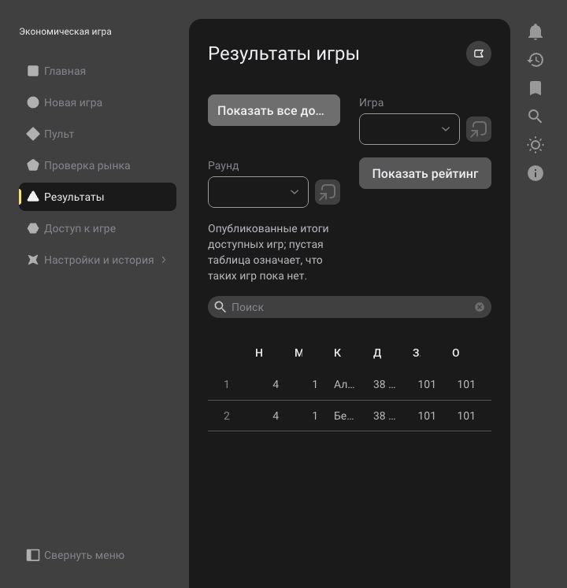

# Деплой тестового приложения

## Главная и автоматическое обновление пульта — 1.0-12

6 октября 2026 года, 21:40:55 МСК, успешно применена сборка `1.0-12` с текущими играми, фазами и проблемными командами на главной, автоматическим обновлением готовности и предупреждением об окончании времени в пульте.

[Открыть приложение «Игра»](https://app-312909758.1cmycloud.com/applications/game-dev).

| Проверка | Подтверждённое значение |
|---|---|
| Технология приложения | `10.0.3-20` |
| Задача обновления | `01a11284-9c46-7745-b1be-257d78fc563c` — `Completed` |
| Работающее приложение | `01a11178-7183-71ae-bfac-e21e4036537f` — `Running` |
| Сборка в приложении | `01a11284-586d-70d6-a970-a832a1a31018` — `1.0-12` |
| Ошибка / текущая задача | Отсутствуют |
| SHA-256 архива | `dc302b5304ed04bb125967fee2100d70ef0662a12d510cc4dd256e24525c200e` |

Перед обновлением сохранён дамп `01a11283-625b-7104-bed3-9d9b78c1eddc`: статус `Ready`, размер 7 950 980 байт, создан в 21:39:22 МСК. Дамп не включает пользователей, бинарные вложения и данные взаимодействия.

Первая попытка (`1.0-11`) выявила обязательный параметр типа события изменения поля игры. Обработчик исправлен на `СобытиеПриИзменении<Игры.Ссылка?>`; статическая проверка теперь выявляет отсутствие параметра. Повторная сборка `1.0-12` прошла нативную компиляцию и обновление.

В браузере открыты таблицы текущих игр и проблемных команд: при отсутствии незавершённых игр показаны соответствующие пустые состояния. В пульте выбрана существующая завершённая игра «Проверка деплоя 06.10.2026»; состояние загрузилось автоматически. Без нажатия кнопки время обновления изменилось с 21:43:32.314 на 21:43:44.317. Ошибок интерфейса не наблюдалось. Живой отсчёт и изменение готовности в активной игре в этом проходе не проверялись.

Локальные проверки: 83 YAML, 77 объектов, 373 UUID; согласованность 34 XBSL-файлов; 23 теста чистой логики и 10 тестов обновления форм — пройдены. Валидация метаданных не выявила ошибок; 31 предупреждение относится к типам UI и контейнеров вне покрытия валидатора.

Архив загружен из локальной рабочей копии `dev`; манифест содержит исходный коммит `33e3636f3b6879e258a24de792a50f272236228f` и последующие локальные изменения. Точный применённый артефакт определяется SHA-256 выше. Изменения фиксируются и отправляются в репозиторий после успешного деплоя по указанию пользователя.

## Предыдущий деплой — 1.0-10

6 октября 2026 года, 21:14:59 МСК, к существующему приложению применена сборка `1.0-10` из локальной рабочей копии ветки `dev`. Нативная компиляция и обновление завершены успешно.

[Открыть приложение «Игра»](https://app-312909758.1cmycloud.com/applications/game-dev).

| Проверка | Подтверждённое значение |
|---|---|
| Технология приложения | `10.0.3-20` |
| Задача обновления | `01a1126c-e1d3-75cf-83a9-4e86961da4bb` — `Completed` |
| Работающее приложение | `01a11178-7183-71ae-bfac-e21e4036537f` — `Running` |
| Сборка в приложении | `01a1126c-a22a-7d68-868b-b4f4a8bbf125` — `1.0-10` |
| Ошибка / текущая задача | Отсутствуют |
| SHA-256 архива | `2509c4c5ee90bb308633d053e762b946907b5f06e3020b86a65d09c5f9be0180` |

Перед обновлением сохранён дамп `01a111f5-0a2b-7d7f-8c1f-64c21b401079`: статус `Ready`, размер 6 918 667 байт. Дамп создан без пользователей, бинарных вложений и данных взаимодействия.

## Исправленные ошибки

- Логические выражения приведены к синтаксису XBSL: `и`, `или`, `не`.
- Серверные методы, вызываемые формами, размещены в модулях `КлиентИСервер` с аннотациями серверного выполнения. Устранены повторные аннотации.
- Вложенные команды форм описаны без недопустимого имени. Содержимое разделов обёрнуто в группы, исправлено экранирование строк YAML, перечисления получили значения по умолчанию.
- Литералы запросов перенесены из модулей вложенного типа `.Объект` в менеджеры сущностей. Значения свойств передаются через скалярные переменные. В запросах к табличным частям используется `Владелец`, а суммы пустых выборок преобразуются через `.ЗаменитьNull(0)`.
- Для кодов номенклатуры отключена автоматическая нумерация, запрещавшая `CityRide` и другие строковые коды.
- Код области ERP допускает пустое значение: демонстрационная игра создаётся без отложенной настройки ERP.
- В форме предварительного расчёта указаны длины целой и дробной частей чисел: цены с копейками и дробные коэффициенты отображаются без ошибок проверки ввода.

UUID, совместимость 10.0 и данные приложения сохранены. Локальный `scripts/check_sources.py` теперь выявляет ошибочные логические операторы, запросы во вложенных модулях и обращение к свойству непосредственно после `%`.

## Проверки в браузере

На сборке `1.0-9` создана демонстрационная игра **«Проверка деплоя 06.10.2026»** с двумя командами. Пройдены мастер и загрузка базового сценария, подготовка/фиксация правил, запуск, пауза и возобновление, стартовый раунд и все четыре производственных раунда. В каждой фазе принята готовность двух команд; рынки сохранены, тестовые отгрузки и оплаты приняты, раунды закрыты, игра завершена и рейтинг опубликован. Повторный запуск команды формирования итогов стартового раунда завершился без ошибки.

В последнем раунде для каждой команды подтверждены: 101 заказанная и отгруженная единица, выручка и оплата 7 772 000, остаток готовой продукции 19, нулевые долги. Итоговые деньги каждой команды — 38 860 000; при равенстве обе получили место 1. Это тестовый сценарий с полной оплатой и без моделирования производственных затрат, прибыль в примере равна нулю.

На окончательной сборке `1.0-10` повторно проверены отображение дробных чисел без сообщений валидации, встроенные проверки алгоритмов и предварительный рынок: спрос 120, доступность 200, по 60 заказов двум командам. Между `1.0-9` и `1.0-10` изменены только настройки числового ввода формы рынка; серверные модули игры остались прежними. Опубликованный рейтинг доступен после обновления.

Локальные проверки: 79 YAML, 73 объекта, 369 UUID; согласованность 33 XBSL-файлов; 14 тестов чистой логики — пройдены.

Не проверялись отдельные учётные записи ведущего/наблюдателя, конкурентные действия двух ведущих, запросы со старыми версиями/токенами, истечение дедлайна и исправление ранее принятых финансовых фактов. Проверки обмена и подключения ERP остаются отложенными по решению пользователя.

## История и способ загрузки

Предыдущая успешная сборка `1.0-4` содержала каркас метаданных. Сборки `1.0-5` и `1.0-6` были отклонены компилятором; `1.0-7` прошла компиляцию. По проверкам интерфейса внесены дополнительные исправления в `1.0-8`, `1.0-9` и `1.0-10`.

Деплой выполнен загрузкой `.xasm` из локальных файлов, а не синхронизацией внешней ветки. Манифест окончательной сборки содержит `dev` и исходный коммит `4b9c8b607e7249e5a5e0a163ceeb6d2821dbaf1a`; архив включает последующие локальные исправления. Точный артефакт идентифицируется SHA-256 выше.

Console API вызывается по адресу `https://1cmycloud.com`; адрес приложения служит для пользовательского интерфейса.
