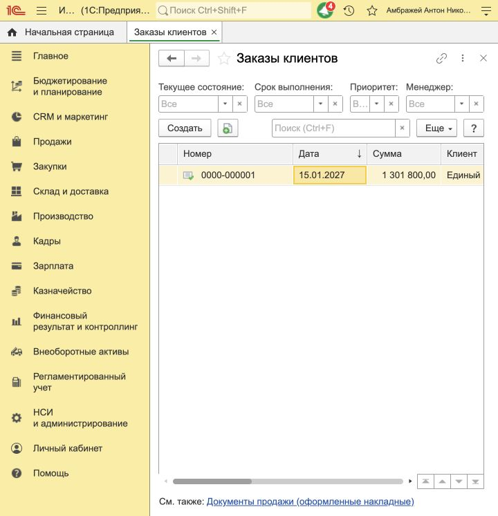

# Заказ рынка в подготовленной ERP

09.10.2026 проверена база `https://edu.1cfresh.com/a/edu_erp_spbpu/1538260/`. Расширение не устанавливалось. Игровая дата — 15.01.2027, организация — «ДвижжОК ООО», склад — «Готовая продукция», покупатель — «Единый покупатель велосипедов», соглашение — «Продажа велосипедов — оплата при отгрузке», вид продажной цены — «Оптовая Велосипеды», без НДС. Учётные данные не включены в исходники или протокол.

| Модель | Продажная цена, ₽ | Физический остаток, шт. | Заказано, шт. | Сумма, ₽ |
|---|---:|---:|---:|---:|
| CityRide | 33 800 | 15 | 15 | 507 000 |
| SportDrive | 40 600 | 8 | 8 | 324 800 |
| CargoMax | 50 600 | 4 | 4 | 202 400 |
| TourPro | 44 600 | 6 | 6 | 267 600 |
| Всего | | 33 | 33 | 1 301 800 |

Цены прочитаны из активных движений `ЦеныНоменклатуры25`, а не выведены из себестоимости или референтной цены сценария. Они действительно совпадают с начальной себестоимостью в этой базе. Остатки подтверждены функцией `ТоварыНаСкладах/Balance` на конец игрового дня. Для одного предложения базы спрос базового сценария превышает запас каждой модели, поэтому заказано всё доступное количество. Это расчёт для одной базы, без моделирования конкурирующих команд.

Создан и проведён **Заказ клиента 0000-000001 от 15.01.2027 12:00:00**, Ref_Key `953b936c-c3b7-11f1-b003-7cc2553c1b47`, статус `КОтгрузке`, сумма **1 301 800 ₽**. Комментарий `BICYCLE_MARKET/1538260/2027-01/initial_sales` служил точным маркером при поиске документа, повторного заказа нет. Документ первоначально записан через OData; первый вызов `/Post` вернул общую ошибку, после чего штатная форма ERP заполнила служебные идентификаторы строк и провела этот же документ.

После изучения [официальной статьи 1cfresh, раздел 6.5.1](https://1cfresh.com/articles/data_odata) вызов в коде приведён к документированному виду `/Post()`. Проверено реальное проведение через OData: этот же заказ отменён методом `/Unpost()`, отдельным GET подтверждён `Posted=false`, затем исходный метод `НастройкаБазOData.ПровестиЗаказOData` исполнен нативным Element Script 10.0. Он вызвал `POST Document_ЗаказКлиента(guid'…')/Post()` с пустым телом и отдельным GET подтвердил `Posted=true`. Повторный запуск не вызвал проведение. Реквизиты, строки, сумма и остатки регистра `ТоварыКОтгрузке` до/после цикла совпали. Расширение и интерфейс ERP для этого цикла не использовались. Проверка относится к сохранённому корректно заполненному заказу; создание нового заказа из игрового расчёта в Элементе ещё не реализовано. Причина первоначального HTTP 500 однозначно не установлена: кроме формы вызова, после первого проведения появились служебные поля строк ERP.

После проведения физические запасы сохраняются. В регистре `ТоварыКОтгрузке` записаны обязательства 15 / 8 / 4 / 6, свободный остаток всех четырёх моделей равен нулю. Реализации и оплаты не создавались: заказ не является фактом продажи.

В исходниках Элемента исправлены два места, блокировавшие эти данные: запрет сохранить начальный пакет, отличающийся от примера, и проверка стартовой цены по границам стратегии следующих раундов. Исправлен также повторный контроль диапазона при расчёте рынка. Начальная цена `frozen` сверяется с принятой ценой ERP; последующие раунды сохраняют границы сценария. В прежнюю форму настройки добавлена отдельная команда чтения готовой базы без записей, с выбором вида цены из соглашения и чтением актуальных регистров, а не документов начального ввода.

Проверены исходные методы чтения и проведения нативным Element Script 10.0 на этой базе; цены, физические остатки и обязательства совпали с Python-клиентом. Проверки покрывают меняющийся начальный пакет, стартовую продажу ниже обычного минимального порога, неизменность правил последующих раундов, последние цены, будущие/неактивные записи, конфликтующие цены, валюту/упаковку, складские измерения, обязательства заказа и пагинацию. Отдельный тест исходного метода проведения со стендовым транспортом проверяет отказ ERP, пометку удаления и повтор после потери ответа. Полная сборка формы и публикация изменений в приложении не выполнялись.

[Машинный протокол](verification/market-erp-2026-10-09.json) содержит снимки до/после заказа, GUID соответствий и результат проверки нативного чтения.

