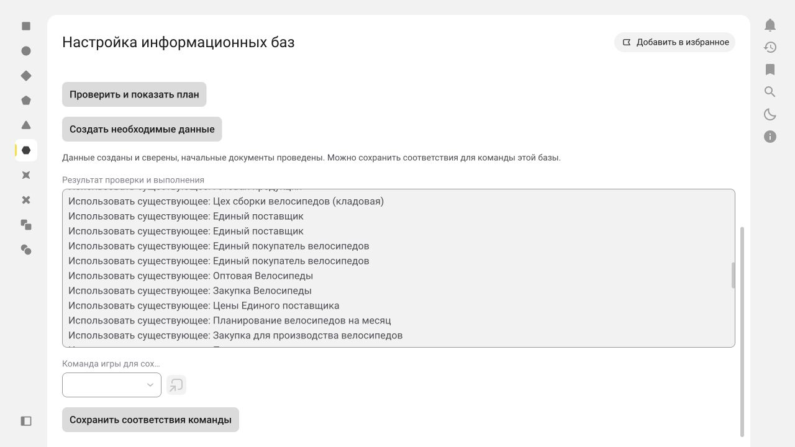

# Настройка учебной ERP через OData

Для уже подготовленной базы используйте **«Прочитать цены и остатки готовой базы»**. Эта команда только читает ERP и позволяет сохранить 15 найденных соответствий без повторного создания начальных документов. Источник продажных цен — регистр `ЦеныНоменклатуры25`, вид цены берётся из действующего соглашения покупателя. Выбирается последняя активная цена не позднее указанной игровой даты и времени, в валюте соглашения, без посторонних характеристик, упаковок и маркетинговых мероприятий. Остатки читаются функцией `ТоварыНаСкладах/Balance`, обязательства — `ТоварыКОтгрузке/Balance`; отчёт раздельно показывает физический запас, количество к отгрузке/в резерве и доступное количество. Чужие склады, характеристики и назначения не включаются. Пароль очищается после чтения.

Дата в форме относится к игровому календарю. В проверенной базе начальные документы датированы 15.01.2027; чтение на текущую календарную дату 09.10.2026 не увидит этих цен и остатков. Для проверки конца игрового дня используйте `2027-01-15T23:59:59`.

Для сохранённого заказа используйте **«Провести заказ клиента через OData»**: выберите его базу, укажите GUID (`Ref_Key`) документа, логин и пароль. Команда сначала читает `Document_ЗаказКлиента`; пометка удаления блокирует проведение, а уже проведённый заказ пропускается. Для черновика выполняется `POST Document_ЗаказКлиента(guid'…')/Post()` с пустым телом, затем отдельный GET проверяет `Posted=true`. Пароль очищается и при успехе, и при ошибке. Нужны корректно заполненные реквизиты ERP: сервер может отказать по своей бизнес-логике. При потере ответа повторите команду с тем же GUID — она сначала проверит фактическое состояние. `Posted` не присваивается через PATCH, режим загрузки не используется. Команда проводит существующий документ; автоматическое создание заказов из игрового расчёта этой кнопкой не выполняется. Для заказа проверенной базы GUID — `953b936c-c3b7-11f1-b003-7cc2553c1b47`. После проведения прочитайте цены и остатки заново.

Формат действия и проверка результата соответствуют [официальной документации 1cfresh, раздел 6.5.1](https://1cfresh.com/articles/data_odata). На учебной базе проверен цикл `Unpost()` → `Posted=false` → исходный метод Элемента с `Post()` → `Posted=true`, без расширения и интерфейса ERP. Строки, сумма заказа и обязательства не изменились; повторный вызов пропустил проведение. Подробности и границы проверки — в [протоколе заказа рынка](market-erp.md).

В административном приложении откройте «Настройка информационных баз». Выберите активное подключение ERP, точное наименование существующей организации, дату начальных документов и учётные данные OData. Выполните «Проверить и показать план», затем «Создать необходимые данные». После успешной настройки выберите команду той же базы и сохраните её 15 соответствий. Изменение базы, логина, организации или даты требует новой проверки.

Пароль используется для текущего вызова, маскируется в форме и очищается после применения. Он не записывается в справочники, профиль, журнал или отчёт. Работа доступна администратору приложения; у пользователя ERP должны быть права чтения, записи и проведения соответствующих объектов.

## Состав профиля

Шаблон подготовки новой базы — `contracts/erp-odata-setup.json`, профиль `BICYCLE_SIMPLE/1.0`. `scripts/generate_odata_setup_profile.py` формирует литерал серверного модуля. GUID новых записей генерируются однажды; зависимости используют фактические GUID из ответов ERP. Профиль не содержит ссылки конкретной базы. При чтении готовой базы шаблон используется для поиска НСИ, но цены, количества и вид продажной цены берутся из ERP.

63 последовательных шага сопоставляют обязательные классификаторы и организацию, создают недостающие единицы, группы финансового учёта, виды и позиции номенклатуры, характеристики, подразделение, три неордерных склада, партнёров и контрагентов, виды цен, соглашения, месячный сценарий и пять видов планов. Для четырёх моделей создаются действующие ресурсные спецификации с одним этапом, пятью материальными нормами, без рабочих центров и трудозатрат.

Создаются и проводятся три типовых документа: установка 15 начальных цен, регистрация 11 цен поставщика и ввод четырёх остатков готовой продукции. Количества: 15 / 8 / 4 / 6; стоимость: 33 800 / 40 600 / 50 600 / 44 600 руб. Суммарная стоимость запасов — 1 301 800 руб. Наименование организации и дата задаются в форме; значения шаблона по умолчанию — «ДвижжОК ООО», 15.01.2027.

## Повторный запуск и ошибки

Предварительная проверка читает все нужные коллекции и реквизиты, выявляет дубли, пометки удаления и конфликты до первой записи. `$metadata` не требуется: опубликованные поля проверяются запросами `$select`.

Записи ищутся по наименованию, характеристики дополнительно по владельцу. Типовые документы ищутся по точному маркеру комментария; из-за неограниченной длины этого реквизита фильтр использует `substringof`, затем проверяет полное совпадение. Неоднозначное соответствие блокирует настройку.

ERP не поддерживает общую транзакцию всех OData-запросов. При ошибке обработка останавливается и сообщает шаг и число завершённых операций. Повторный запуск проверяет сохранённые записи и продолжает работу. Недостающий ответ после записи или проведения не вызывает повторного хозяйственного результата: документ повторно читается, проведённый документ только сверяется. Изменённый проведённый документ вызывает конфликт; автоматически перепроводить его нельзя. Доработка спецификаций и соглашений разрешена только для записей с маркером данного профиля. Подключение блокируется на время серверного вызова для защиты от параллельных запусков из приложения.

## CLI и проверки

Чтение готовой базы без записей:

```sh
python3 scripts/read_erp_market.py --url https://host/publication/ --organization-name 'ДвижжОК ООО' --as-of 2027-01-15T23:59:59 --output /tmp/market.json
```

Учётные данные также передаются через `ERP_ODATA_USER` и `ERP_ODATA_PASSWORD`. Чтение не заменяет полную проверку денежных средств, долгов, себестоимости и готовности всех игровых фаз.

Для обследования и интеграционной проверки доступен `scripts/setup_erp_odata.py` с тем же профилем. Логин и пароль передаются переменными окружения `ERP_ODATA_USER` и `ERP_ODATA_PASSWORD`.

```sh
python3 scripts/setup_erp_odata.py --url https://host/publication/ --output /tmp/plan.json
python3 scripts/setup_erp_odata.py --url https://host/publication/ --apply --output /tmp/result.json
```

При необходимости задайте `--organization-name` и `--setup-date YYYY-MM-DDTHH:MM:SS`. По умолчанию CLI только читает данные. HTTP перенаправления запрещены; адрес должен использовать HTTPS. Параметры фильтра кодируются с `%20`: учебный 1cfresh не интерпретирует `+` как пробел в фильтре.

09.10.2026 на предоставленной базе edu.1cfresh проверены создание и повторное выполнение профиля, 15 уникальных пар «номенклатура — характеристика», четыре спецификации и проведение начальных документов. Прочитаны реальные приходные движения регистра «ТоварыНаСкладах», четыре записи себестоимости на 1 301 800 руб., 15 цен в регистре «ЦеныНоменклатуры25» и 11 цен в регистре поставщика. Нативный HTTP-клиент 1С:Элемент 10.0 выполнил предварительную проверку и повторное применение 63 шагов. Учётные данные в протокол проверки не включены.

`python3 scripts/test_odata_setup.py` проверяет восстановление после потери ответов, реальные UUID ERP, блокировку конфликтов до записей и отсутствие повторного проведения. Эти тесты используют транспортный стенд в памяти; их результат не заменяет интеграционную проверку.

`scripts/test_odata_posting.py` исполняет исходный метод XBSL нативным Element Script со стендовым транспортом: корректный action и пустое тело, отказ ERP, запрет для пометки удаления, отсутствие повторного проведения и восстановление после потери ответа.

## Границы подготовки

Настройка НСИ через OData работает без расширения ERP. Она не реализует команды игровых фаз, автоматические закупки/реализации, финансовые снимки и закрытие месяца: эти возможности по проектному контракту относятся к расширению ERP. Пять видов планов создаются, однако правила автоматического заполнения из планов продаж, остатков и спецификаций требуют настройки источников данных планирования. Денежные счета, нулевые деньги, отсутствие долгов и чужих остатков существующей организации этим профилем не сбрасываются и должны проверяться перед стартом игры. Наличие кнопки настройки не означает готовность всей игровой области.

Полная компиляция и применение сборки `1.0-35` к `game-dev` завершены успешно (задача `Completed`, приложение `Running`, ID активной сборки проверен). В опубликованной форме проверены план, повторное применение и очистка пароля. [Протокол проверки](verification/odata-setup-2026-10-09.json).

Новые команды чтения и проведения заказа, изменения правил начального пакета проверены отдельно в исходниках и нативном Element Script. Это не подтверждает публикацию новой версии формы; сборка `1.0-35` относится к прежней кнопке подготовки. [Проверка базы и заказ рынка](market-erp.md).


