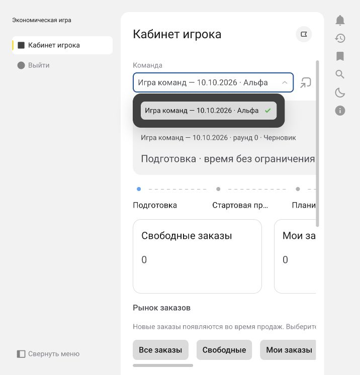

# Кабинет игрока и общий рынок заказов

Кабинет реализован в `Управление/КабинетИгрока.yaml` и `.xbsl`. Навигация приложения содержит пункт «Кабинет игрока». Визуальный [эскиз с демонстрационными данными](previews/player-cabinet.html) показывает композицию и действия; это отдельный макет, а не снимок работающего Элемента.

## Экран

- Верхняя карточка: команда, игра, раунд, статус и таймер. Текущий этап показывает нативная `ПанельЭтапов<ФазыИгры>`; выбирать этап вручную игрок не может.
- Четыре карточки показателей: свободные заказы, заказы команды, сумма портфеля, число команд, завершивших этап. Портфель — сумма полученных заказов, включая ожидающие ERP; это не оплаченная выручка.
- Рынок: адаптивная сетка карточек с моделью, количеством, ценой, суммой, статусом и командой-получателем. Фильтры «Все / Свободные / Мои». Нажатие на карточку показывает её детали и действие получения или повторной отправки.
- Готовность команды: комментарий и «Завершить подготовку» / «Завершить этап». После подтверждения комментарий и получение новых заказов недоступны до нового этапа. Заявления других команд видны в кабинете, а в пульте ведущего — в отдельной колонке «Игроки завершили».
- Доступ ERP: сворачиваемая секция с логином и маскированным паролем для открытого сеанса. При смене команды поля очищаются. Учётные данные не записываются в метаданные, сообщения обмена или протоколы.

Состояние обновляется каждые пять секунд, таймер — каждую секунду. При ошибке чтения данные и действия скрываются до следующего успешного обновления. Ответ предыдущей выбранной команды не заменяет текущий кабинет.

## Доступ и включение

1. Создать игру с флажком «Случайные заказы: команды сами разбирают общий рынок». В мастере он включён по умолчанию. В существующей игре режим можно изменить в карточке игры до подготовки; после подготовки он зафиксирован. Старые игры сохраняют автоматическое распределение.
2. В «Доступе к игре» выбрать пользователя, команду и признак «Активно», нажать «Назначить игрока выбранной команде». У одного пользователя может быть несколько назначений. Кабинет автоматически выбирает первую доступную команду, остальные доступны через поле команды. Администратор может проверить кабинет любой активной команды.
3. Для реальной игры настроить активное подключение ERP команды, организацию (по умолчанию «ДвижжОК ООО»), игровой календарь и подготовленную базу профиля `BICYCLE_SIMPLE`. Для получения заказов игрок вводит данные доступа к базе в открытом кабинете.

`ИгрокиКоманд` — отдельные назначения; они не дают роль ведущего. Все клиентские серверные команды проверяют пользователя и принадлежность к команде до привилегированного чтения и повторно после блокировки игры. Игрок получает публичную сводку рынка, а не приватные снимки, финансовые показатели соперников или секреты подключений. Чтение справочника команд разрешено игроку только для его назначенных активных команд в текущих играх; права на игры, снимки и расчёты не расширены.

## Случайное появление заказов

Во время открытой стартовой продажи и продаж сервер выбирает модель, количество 1–5 шт. и следующий интервал 30–90 секунд. Seed игры и номер раунда обеспечивают воспроизводимость. Цена берётся из референтной цены модели; случайны состав, объём и время, а не цена. Суммарный объём по модели ограничен базовым спросом с трендом, включая настройку тренда текущего раунда.

Заказы создаются при серверном обновлении кабинета по сохранённому `СледующийЗаказ`. Обновление браузера не меняет результат и не создаёт дополнительный пакет. При пропусках обновлений сервер догоняет прошедшее время, до 120 пакетов за одно чтение. Пока все кабинеты закрыты, отдельный фоновый процесс не работает: заказы материализуются при следующем чтении, если этап продаж ещё открыт. Пауза останавливает генерацию; возобновление назначает следующее появление через 30 секунд. После срока или фиксации этапа новые заказы не появляются.

Записи `ЗаказыРынка` хранят общий пул. Публикация, получение и фиксация используют одну блокировку игры, поэтому конкурирующие кабинеты не создают дубли и не получают один заказ в разные команды.

## Получение и OData

Получение любого свободного заказа закрепляет его за текущей командой в отдельной транзакции **до** сетевого запроса. Другие команды сразу видят получателя и статус «Отправляется». Состав и сумма берутся из серверной записи заказа; клиент не задаёт базу, количество, цену или получателя.

Сервер использует подготовленные реквизиты `BICYCLE_SIMPLE`: организация команды, единый покупатель велосипедов, его контрагент и соглашение, склад готовой продукции, рубли, штуки, без НДС. Перед первым созданием проверяется свободный остаток. Создаётся `Document_ЗаказКлиента` с игровым календарём, заполненными служебными полями строки и стабильным маркером `BICYCLE_PLAYER/<UUID заказа рынка>`. Проведение выполняется через `POST .../Post()` с пустым телом; отдельный GET проверяет `Posted=true` и состав проведённого заказа.

Повтор сначала ищет существующий документ по точному маркеру. Изменённый, неоднозначный или помеченный на удаление документ отклоняется. Проведённый документ повторно не проводится. Для уже полученного заказа разрешён повтор после истечения срока продаж; новый заказ в закрытом рынке получить нельзя. Параллельная отправка того же заказа блокируется арендой попытки на 15 минут; после зависания повтор становится доступен владельцу.

Первый доказанный отказ **до создания** (доступ, отсутствие запаса, неверная настройка) возвращает заказ в свободный пул. При неизвестном результате HTTP, отказе проведения либо сбое сохранения подтверждения заказ остаётся за командой: возвращать его другим участникам нельзя, пока документ может существовать в ERP. Завершение этапа и фиксация ведущим ожидают подтверждения таких полученных заказов.

В демонстрационной игре OData не вызывается; статус «Принят в демо» явно отделён от проведения в ERP.

## Итоги и готовность

В режиме общего рынка окончательный расчёт формируется по действительно полученным и подтверждённым заказам. Автоматическое создание заказов по прежним долям отключено. Полученный заказ записывается в существующую историю команд ERP как уже выполненная операция, чтобы очередь обмена не создавала копию. Заказ не является реализацией или оплатой.

Для нескольких заказов одной модели отгрузки проверяются в пределах конкретного `erpOrderId`, а не общей суммы по модели. Новое поле `ИсполнениеПродаж.ИдЗаказаERP` сохраняет эту связь. Финансовые события должны передаваться после фиксации окончательного расчёта раунда; до этого контракт ERP отклоняет событие с ещё не существующим `allocationId`. Новые операции OData по реализации и оплате не добавлялись.

`ЗаявленияКоманд` сохраняют команду, раунд, токен этапа, пользователя, время, комментарий и `ЗапрошенаБлокировкаERP`. Повтор идемпотентен. На новом этапе нужно новое заявление; при паузе/возобновлении заявление переносится в новый токен той же фазы. Для команд с активными игроками ведущий ожидает заявление перед закрытием этапа. Позднее заявление возможно, пока ведущий ещё не начал фиксацию.

Заявление игрока не подменяет подтверждённый снимок и техническую готовность ERP. Существующие проверки ведущего продолжают их требовать. **Изменения в ERP сейчас не блокируются**: поле запроса блокировки является заделом для будущего адаптера, который применит запрет в игровой области и сохранит отдельное подтверждение результата.

## Проверка

Метаданные, обработчики, импорты, привязки и локальные регрессии проверяются штатными скриптами. `scripts/test_player_market.py` выполняет оригинальный генератор и тело создания заказа нативным Element Script 10.0 с тестовым транспортом: 1000 воспроизводимых пакетов, границы параметров, создание и проведение, повторы, потеря ответа после POST и Post(), отказ ERP, пометка удаления, изменённые сумма/строка и недостаточный запас. Реальная ERP при тестах не изменяется.

Полная облачная компиляция, нативный рендер кабинета и основные действия в отдельной демонстрационной игре проверены: появление заказа, получение, видимость владельца другой команде и заявление о завершении этапа. [Протокол публикации](deployment.md) содержит точную сборку и подтверждение задачи обновления. Доступы двух отдельных игроков, конкурентное получение в БД и создание нового документа в реальной ERP этой доработкой ещё не проверялись.

## Роль игрока и пользователи команды — 10 октября 2026

В `ПрикладныеРоли` добавлено отдельное значение **Игрок**. Форма «Доступ к игре» сначала выбирает игру, затем предлагает только её активные команды; роль по умолчанию — Игрок. Смена игры сбрасывает команду и загруженные соответствия ERP. Сервер повторно проверяет принадлежность команды выбранной игре.

Карточка команды содержит раздел «Пользователи команды · роль Игрок». Здесь можно добавить существующего пользователя, отключить назначение или создать нового игрока. Пользователь создаётся в списке приложения, подключается к приложению и получает назначение в этой команде. Пустое поле временного пароля означает генерацию случайного значения; результат доступен администратору в маскированном поле до закрытия формы. Пароль не сохраняется в метаданных команды и очищается из поля ввода при успехе и ошибке. При первом входе пользователь сменит временный пароль. Если логин уже существует, его пароль не меняется: нужно явно выбрать существующего пользователя.

Назначение игрока запрещено для администратора приложения и владельца игры. Оно отключает назначения ведущего и наблюдателя этому пользователю в выбранной игре; назначения в остальных играх не меняются. Активные игроки хранятся в `ИгрокиКоманд`, а значение роли в `НазначенияПользователей` отражает наличие активных назначений.

Игрок видит пункт навигации «Кабинет игрока» и попадает в кабинет при входе. Начиная со сборки 1.0-46, команда «Выйти» размещена в дополнительном командном интерфейсе приложения, справа внизу. Команда «Выйти» вызывает штатное завершение только текущего сеанса; на экране «Работа завершена» доступна кнопка «Войти» для следующего входа. Переходы по внешним навигационным ссылкам на служебные формы перенаправляются в кабинет. В списке кабинета скрыты завершённые, отменённые и помеченные на удаление игры, отключённые команды и отозванные назначения. Серверная проверка также запрещает чтение и действия в завершённых/отменённых играх. RLS команды рассчитывается по игре и порядку участника: игрок читает только собственные назначенные команды; публичная сводка остальных команд продолжает поступать через проверяемый сервис кабинета.

Пересчёт RLS выполняется при назначении/отключении игрока, изменении статуса игры, ведущего, активности или принадлежности команды. Обновление проекта `player_access_v2` пересчитывает права существующих записей.

В приложении создана обычная игра **«Игра команд — 10.10.2026»**, статус Черновик, сценарий «Велосипеды — базовый профиль», свободный рынок включён. Команды: Альфа (team_1, Игрок, активен) и Бета (новый team_2, Игрок, активен). Подготовка, запуск и настройка ERP этой игры не выполнялись.

Проверены облачная компиляция, фильтр команд по выбранной игре, сохранение роли team_1, чтение пользователей команды и создание team_2 с назначением в Бету. На сборке 1.0-44 выполнен вход под team_1: кабинет открылся автоматически, список команд содержит только «Игра команд — 10.10.2026 · Альфа», административных пунктов меню нет. Прямая ссылка на пульт ведущего перенаправляет в кабинет. Выход и повторный вход team_1 проверены. Независимый вход под team_2 и реальный обмен ERP не выполнялись. Локальные тесты выполняют исходные обработчики формы с подставленными сервисами и не заменяют проверку RLS в БД под отдельной учётной записью.

